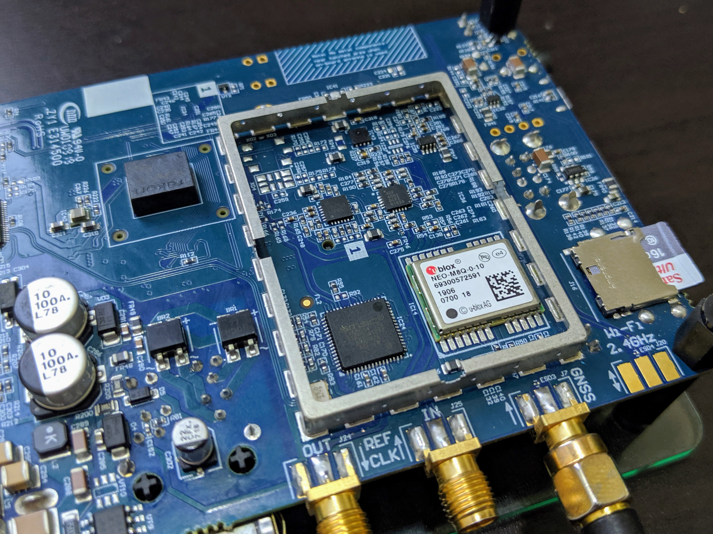
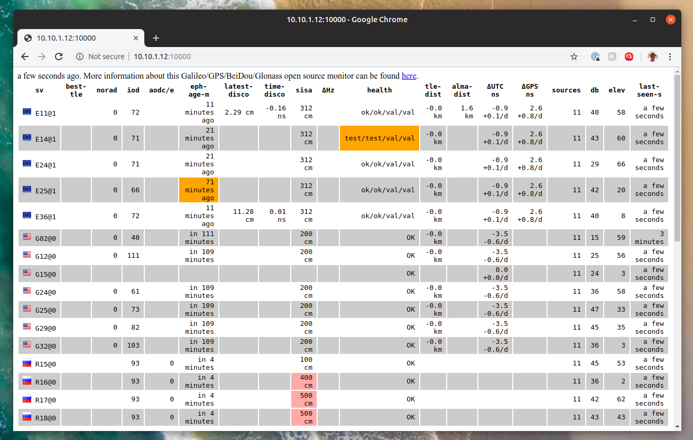

+++
title = "Monitoring GNSS Constellations with Galmon Using the LimeNET Micro Ublox-M8 Module"
date = "2019-09-20"
author = "Luigi Cruz"
authorTwitter = "luigifcruz"
showFullContent = false
slug = "using-limenet-internal-gnss-constellation-monitor"
cover = "https://test.luigi.ltd/2019-09-20/using-limenet-internal-gnss-constellation-monitor/images/limenet-gnss-module.jpg"
+++

In this blog post, I will explain how I managed to get a GNSS multi-constellation monitor called Galmon working on my LimeNET Micro. The Galmon project is a crowdsourcing tool developed by [@PowerDNS_Bert](https://twitter.com/PowerDNS_Bert) to monitor the health status of GNSS constellations including the GPS, GLONASS, BeiDou and more notably Galileo. The project relies on volunteers to set up inexpensive stations based on the Ublox-M8 module to receive GNSS packets and send diagnostic data back to an aggregator.



This data gathering has [already proven](https://twitter.com/GalileoSats/status/1169160015829225472?s=20) to be very useful to diagnose if something weird is happening. This monitoring system can be particularly fun since the European GNSS System called Galileo is on its early operational state. The European Global Navigation System was initially proposed in 1999 with the first operational launch happening in 2011. Even though this project is almost as old as me it's still encountering some trouble. From failed to reach orbit early [launches](https://www.theguardian.com/technology/2014/aug/24/galileo-gps-satellites-launched-into-wrong-orbit) to failing onboard [atomic clocks](https://spacenews.com/rash-of-galileo-clock-failures-cast-doubt-on-timing-of-upcoming-launches/) and more recently the week-long widespread [outage](https://www.wired.com/story/galileo-satellite-outage-gps/).

## Hardware
I bought an Ublox NEO-M8N module from China for another project last year. But I ended up with a counterfeit unit without the specified Flash memory. This non-volatile memory is supposed to save the current configuration and store the firmware upgrade once is installed. This isn't a huge problem since I can automatically configure the module each time I power it up. But unfortunately, my unit also has an ancient firmware that doesn't even support the Galileo and BeiDou constellations. Ohh well, next option...


Lime Microsystems kindly sent me a unit of their newest SDR board, the LimeNET Micro. This is an amateur version of the original carrier-grade LimeNET founded on Crowd Supply a couple of years ago. This newer version is basically a LimeSDR Mini integrated with a Raspberry Pi Compute Module 3+ in a single PCB. Like his older brother, this version is meant to be used mainly for a cellular micro base station. I'll give more details in the full review article coming soon. But for now, let's talk about the awesome (and 100% genuine) built-in GNSS module.


Since this unit is meant to be used as a cellular base station, it is designed to have an extremely precise oscillator (+/- 5 ppb). Which is much better than the LimeSDR Mini (+/- 4 ppm). This is archived by an onboard OCXO locked with the GNSS atomic clocks. To do that, the PLL uses the PPS signal generated by the built-in Ublox NEO-M8Q GNSS module. This is an extremely popular GNSS module capable to receive up to three systems simultaneously like GPS, Galileo and one of BeiDou or GLONASS.


The GNSS Module Serial TX pin is connected to the Raspberry Pi Serial RX by default. This is fine if you only want to receive the standard NMEA. But this isn't enough for this project. We need a bi-directional communication between the Raspberry Pi and the module to configure it properly. Luckily, the LimeNET team left some [options](https://discourse.myriadrf.org/t/gps-on-usb/4670/2) for us:


* **Serial Interface:** Connect the GNSS RX to the RPi TX by soldering one 0R resistor to R57. The location of this resistor is quite difficult to access. Since the LimeSDR also interfaces with the GNSS module using this port, the FPGA GNSS TX Pin shouldn't be configured as OUTPUT.
* **USB Virtual Serial Interface:** Connect the USB Differential Data Pins by soldering two 0R resistors to R96 and R97. The location of these resistors is on the top of the unit facilitating a lot the soldering process.


Since I plan to use the Serial Interface for an upcoming project. I decided to use the USB Serial Interface. The soldering was quite easy to make using a cheap fixed temperature soldering iron. Keep in mind that this process can damage your board if too much heat gets applied in the wrong spot. If you aren't confident enough, try to train with some dead PCB before attempting this. After the soldering process was done, the Ublox module showed up in the Linux USB Stack. Please note that no installation is required to be able to see the module in this list. Consider reworking your solder if none is found.

```
$ lsusb
Bus 001 Device 005: ID 0403:601f Future Technology Devices International, Ltd
Bus 001 Device 004: ID 1546:01a8 U-Blox AG
Bus 001 Device 003: ID 0424:ec00 Standard Microsystems Corp. SMSC9512/9514 Fast Ethernet Adapter
Bus 001 Device 002: ID 0424:9514 Standard Microsystems Corp. SMC9514 Hub
Bus 001 Device 001: ID 1d6b:0002 Linux Foundation 2.0 root hub
```

## Software
The software that inspired this whole project, as previously said, is called Galmon and was written by [@PowerDNS_Bert](https://twitter.com/PowerDNS_Bert). The GNSS module configuration and data extraction from the RAW frames is meticulously explained by his [blog post](https://ds9a.nl/articles/posts/galileo-notes/). This process is quite convoluted but in short, the software configures the Ublox NEO-M8 to start listening to multiple GNSS services at once and instructed to dump all the RAW frames (UBX-RXM-SFRBX) into the serial port (the USB Virtual Serial Port in my case). The received data is then processed by Galmon and stored on a local log file. This data can also be uploaded in real-time to the [galmon.eu](https://galmon.eu) pool. This global crowdsource of GNSS data enables Galmon to accurately monitor the health status of a big part of all GNSS constellations of the planet.


After cloning the project's [repository](https://github.com/ahupowerdns/galmon) on GitHub, the installation process went smoothly by following the installation instructions available in the readme file. Once the compilation was succeeded, I went ahead and started listening to the Ublox Module via the serial port with "ubxtool" and started the web-based monitor called "navparse".

```
$ ./ubxtool --gps --glonass --galileo --wait /dev/ttyACM0 1 | ./navparse 0.0.0.0:10000 html null
Listening on 0.0.0.0:10000                                                                                                                                          
Sending version query                                                                                                                                               
swVersion: ROM CORE 3.01 (107888)                                                                                                                                   
hwVersion: 00080000                                                                                                                                                 
Extended info: FWVER=SPG 3.01                                                                                                                                       
Extended info: PROTVER=18.00
Extended info: GPS;GLO;GAL;BDS
Extended info: SBAS;IMES;QZSS
Sending GNSS query
GNSS status, got 7 rows:
GNSSID 0 enabled 1 minTrk 4 maxTrk 8 1 0  1 1
GNSSID 1 enabled 0 minTrk 3 maxTrk 4 0 0  1 1
GNSSID 2 enabled 1 minTrk 4 maxTrk 8 1 0  1 1
GNSSID 3 enabled 0 minTrk 4 maxTrk 8 0 0  1 1
GNSSID 4 enabled 0 minTrk 0 maxTrk 8 0 0  1 3
GNSSID 5 enabled 0 minTrk 4 maxTrk 8 0 0  1 5
GNSSID 6 enabled 1 minTrk 6 maxTrk 8 1 0  1 1
Got an ack for 6 62 while waiting for 6 62
Got ACK for our poll of GNSS settings
Sending GNSS setting, GPS: 1, Galileo: 1, BeiDou: 0, GLONASS: 1, SBAS: 0
Got an ack for 6 62 while waiting for 6 62
Got ack on GNSS setting
Disabling NMEA
Got an ack for 6 0 while waiting for 6 0
NMEA disabled
Polling USB settings
Protocol settings on USB:
3 0 0 0 0 0 0 0 0 0 0 0 3 0 1 0 0 0 0 0
Got an ack for 6 0 while waiting for 6 0
Got ACK on USB port config
Enabling UBX-RXM-RLM
Enabling UBX-RXM-RAWX
Enabling UBX-RXM-SFRBX
Enabling UBX-NAV-POSECEF
Enabling UBX-NAV-SAT
Enabling UBX-NAV-PVT
Entering main loop
src 11 currently receiving: 2,24@1
src 11 currently receiving: 0,2@0 0,12@0 0,15@0 0,24@0 0,25@0 0,29@0 0,32@0 2,11@1 2,14@1 2,24@1 2,25@1 2,36@1 6,15@0 6,16@0 6,17@0 6,18@0
```

This command creates a web dashboard to monitor the current satellites being received by your station in real-time. This panel shows a bunch of cool diagnostics for each satellite, like health status, elevation, signal-to-noise ratio, and ephemeris age. To start feeding the observation data to the central Galmon server you need to ask for a callsign and server address to [@GalileoSats](https://twitter.com/GalileoSats) on Twitter. By doing this, your station will be shown in the [Earth Map](https://galmon.eu/geo/) with an estimated position. 



**Disclaimer:** The article made possible by the LimeNET Micro sample sent for me free of charge by Lime Microsystems. No compensation was requested or provided. Opinions are completely mine and no copy approval was given. You are seeing this post at the same time as they are.
