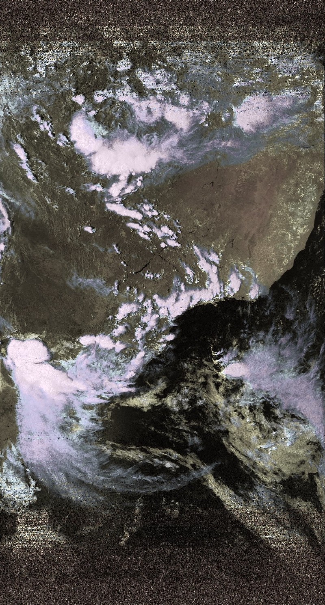
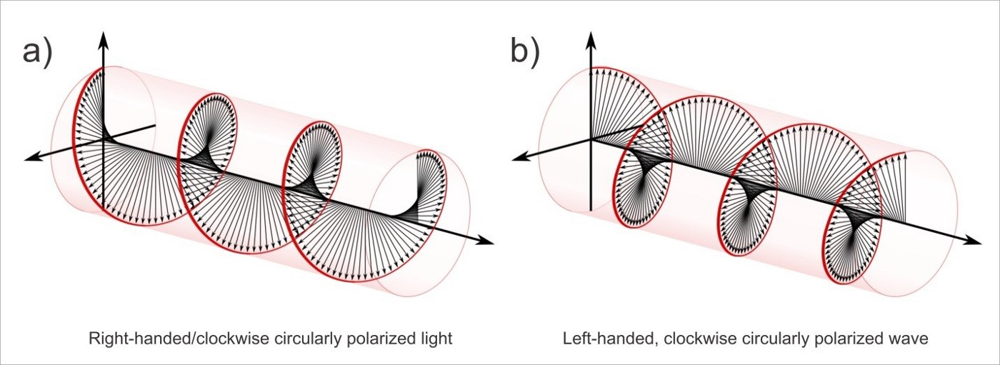
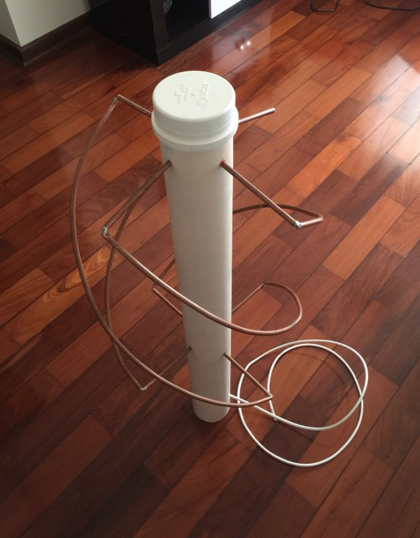
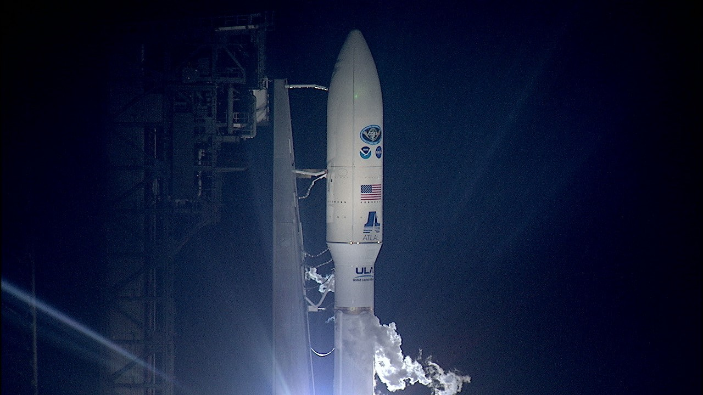

+++
title = "Quadrifilar Antenna for NOAA APT Satellites"
date = "2017-01-30"
author = "Luigi Cruz"
authorTwitter = "luigifcruz"
showFullContent = false
+++

Today, America and Russia have meteorological satellites orbiting the earth every hour, as they transit thought the planet, they beam down images with a visible, mid-near infrared or infrared spectrum. With infrared is possible to identify clouds even at night as well as the temperatures of the land, sea or cloud tops.



This signal is fairly weak, so I need a big antenna. There are several types but the best choice is the QFH (QuadriFilar Helicoidal) Antenna which have the right polarization for this type of signal and it’s easy to build. Many people also use the Turnstile Antenna which works pretty well for them too.

## Basic Theory
They use various methods to transmit the images, more notability APT or LRPT. The analog signal APT (used by NOAA) and the digital LRPT (used by Meteor-M) are the easiest to receive, as they transmit in the 137 Mhz band and have low bandwidth. The APT signal is an old transmission method, hence have lower resolution, and LRPT is a much newer protocol which transmit relatively high resolution digital images.



These signals are transmitted with polarization, which means that I’ll need to use a polarized antenna to get the best SNR possible. In this case the signal is RHCP, therefore I need to make the antenna with a anti-clockwise helix.

## Design
This antenna have three main parts, the inner tube, outer tube and the helix. I inspired the design in three projects from the internet ([1](http://abdallah.hiof.no/QFH/), [2](http://www.askrlc.co.uk/), [3](http://tinhatranch.com/how-to-build-a-qfh-quadrifilar-helix-antenna-to-download-images-from-weather-satellites/#.WI6AOnCZNo6)). The dimensions of the three projects are the same, so feel free to use their projects as reference too.



The outer tube is designed to be the antenna support and help with the water & dust protection. And the shorter inner tube is designed to frame the helix frame and the balun. The balun is a four turn inductor made with the cable to reduce the overall interference, photo in the gallery below.
The antenna have four helix, two shorter and two larger. See the table in Materials to get the full dimensions. Since this antena is RHCP the helix needs to be turn anti-clockwise to work. The cable is a common coaxial cable, fancy shielding isn’t required for this length and frequency.

## Materials
For this particular antenna I used 8mm copper tubes, but every conductive wire should work. But is critical to follow the dimensions strictly, otherwise your antenna won’t be tuned in the right frequency and loose SNR.

Bill of Materials:      
- 1m 100mm Outer PVC Tube
- 20cm 32mm Inner PVC Tube
- 5m 8mm Copper Tube
- 4x <2mm Steel Screws
- 1x Female F Connector
- 2m Common UHF Coaxial Cable 
- 1x 100mm Tube Cap


```shell
   Tubes Dimensions:
                helical      bottom        top            height
                elements     elements      elements

   Long loop     2x812         1x374        2x181          560
   Short loop    2x758         1x356        2x172          512
```

## Construction
The construction is pretty straight foward. I straightened the copper pipes, cut in the right dimension then I made a semicircle and bent vertically to fit in the brackets. The frame pipes should have near 90º angle with the helix part. After completion the antenna should look like a perfect circle if seen from above. I connected the helix with the frame pipes with a thick wire and solder, but a 90º elbow would have worked much better.

## Wiring
The wiring is pretty straightfoward, the longer loop connected with the shorter loop on each side, as shown in the diagram below.


## Receiving & Decoding
To receive the signal we need to know when the satellite will pass over our location, for this task I used [gpredict](http://gpredict.oz9aec.net/). Currently just four satellites transmit the images, here are the list with their frequencies and protocols:
- NOAA 15 APT 137.620 MHz
- NOAA 18 APT 137.912 MHz
- NOAA 19 APT 137.100 MHz
- Meteor-MN2 LRPT 137.900 MHz


To receive the RF Signal in my computer I used a cheap RTL-SDR from my previous story and [GQRX](https://github.com/csete/gqrx) to demodulate and display the signal. The demodulation I use is WFM which give me the best image quality.

Once the audio is recorded, I need [SoX](https://github.com/chirlu/sox) to resample the audio with the right sample-rate for the [WXtoIMG](http://www.wxtoimg.com/) work properly.

```shell
$ sox input.wav output-resampled.wav rate 11025
```

Finally, to convert the audio into a image I use WXtoIMG which have tons of post processing options to improve the image. I also need to manually correct for Image Slant, these instructions can be found easily [here](http://wxtoimg.com/support/wxfaq.html).

## Results
I already made the first test and the SNR was ~40dB with 80° of elevation. See the results in the gallery below, images captured from the NOAA 19 with this antenna without any LNA or filters in a low interference environment. Note that the signal quality is directly affected by heavy clouds and strong interference signals.

## Next up: Geosynchronous
Sun synchronous satellites are awesome, but let’s climb higher! 📡


