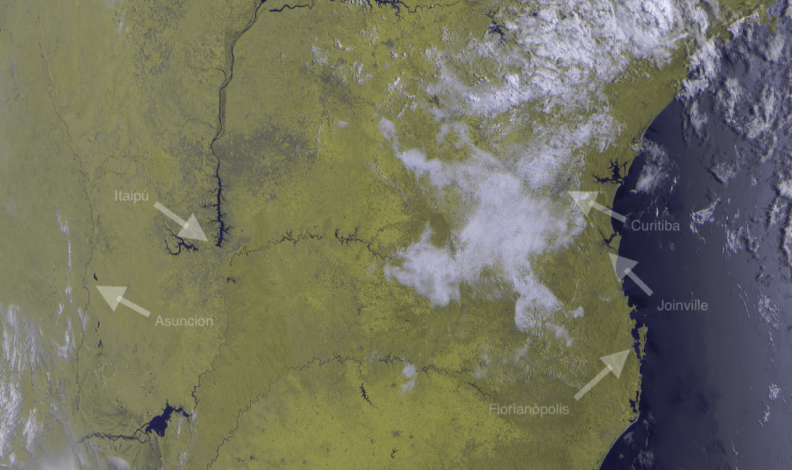
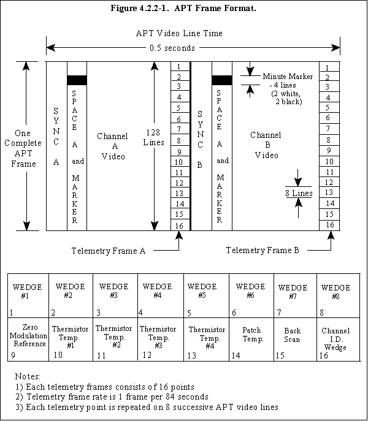
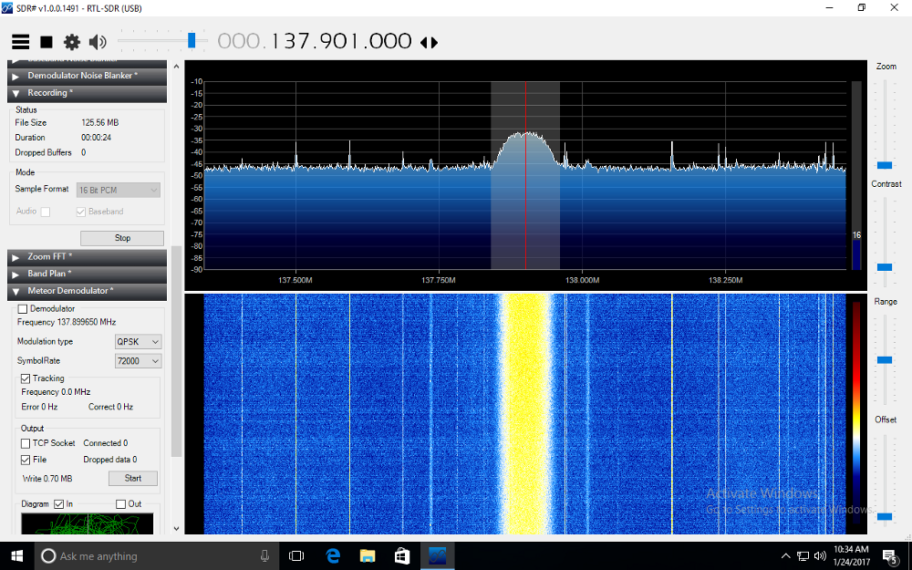
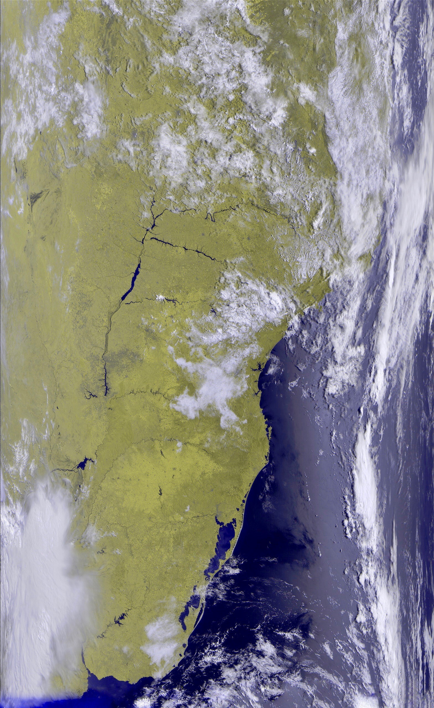
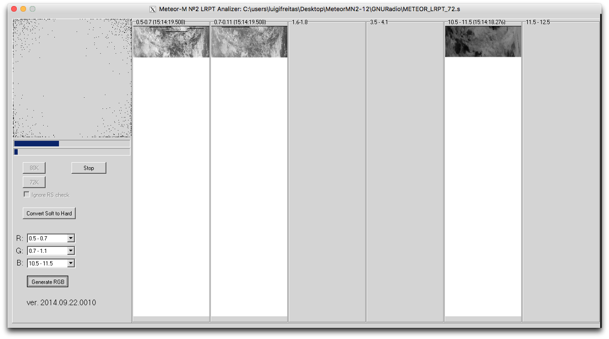

+++
title = "Receiving & Demodulating the Meteor Satellite"
date = "2017-07-10"
author = "Luigi Cruz"
authorTwitter = "luigifcruz"
showFullContent = false
slug = "receiving-and-demodulating-the-lrpt-signal"
+++

In the previous post, I talked about how I got the analog APT earth images from the NOAA sats and how I made my QFH Antenna. As I said, the APT signal is a legacy image transmission method from the 1960s that have strong drawbacks. The newest sats like Meteor-M and MetOp-A have a new protocol with digital modulation called LRPT (Low Rate Picture Transfer). Currently the single sat transmitting this protocol is the Meteor-MN2 and occasionally the Meteor-MN1. Sadly, the LRPT in the MetOp-A satellite is permanently deactivated after cause interference with the HIRS instrument.

The only satellites set to launch which will support LRPT is the next generation of Russian’s Meteor, the Meteor-M N2–1 and Meteor-M 2–2 later this year. The next generation of U.S. polar-orbiting satellites will use a similar protocol called LRD (Low Rate Data) which use a much higher frequency and bandwidth that require a trackable RHCP dish, just like the current HRPT.

## APT vs LRPT
The practical difference between them is the final image resolution and the number of images channels. The LRPT have three digital channels, each pixel of the image corresponds to one kilometer or 0.62 miles of land. By another hand, the APT just have two analog channels, an image resolution 4x smaller and it’s highly susceptible to interference.

The technical differences are the modulation. The LRPT is a modern digital Quadrature Phase-Shift Keying ([QPSK](https://en.wikipedia.org/wiki/Phase-shift_keying)) signal transmitted at an 80 kiloBaud rate. This and the data scrambling make the signal more homogeneous by better distributing the energy through the beam, improving the efficiency and avoiding loose synchronization with the receiver. The LRPT also use error correction techniques, like Convolutional Coding and Reed-Solomon to validate and avoid loosing packages.

The APT is an analog signal with a much simpler structure with no error correction. This makes the signal highly susceptible to interferences, which are very common in 137 Mhz.

## Receiving the Signal
For this, I used the same QFH Antenna that I used to receive the APT Signal. This is possible because the LRPT Signal is transmitted in the same VHF frequency (137 MHz) and is RHCP too. The only difference between them is the bandwidth. The LRPT will look like random noise.

The software to record the LRPT signal was the main problem that I had. The recommended software to do that is the [SDR#](http://airspy.com/download/), which only works with Windows. As a macOS user, I used a VMWare Windows Virtual Machine to run the program, but the result was a crappy image full of missing frames. The problem could be caused by the VM USB driver or the CPU speed with virtualization.

After testing with other versions of Windows, I gave up the Virtual Machine and installed the Windows 7 with Bootcamp. It worked flawlessly and I was Finally able to record a great Meteor-MN2 pass over South America. The full RAW image can be found [here](https://cdn.luigifreitas.me/essays/1486860532514.bmp).

## Signal Demodulation
There are a bunch of software out there to demodulate this signal. I had more success with the [QPSK Demodulator Plugin](http://www.rtl-sdr.ru/page/komplekt-plaginov-dlja-priema-sputnikov) for the SDR#. It’s simple to use and makes a good job. You even get a real-time QPSK constellation. The only downside is that it take a while to lock into the signal, so you end up losing some frames. If you are on a slow computer, you could loose some frames, as it runs side-by-side with the SDR#.
The other solution is to record the WAV 16-bit PCM I/Q signal with the built-in SDR# plugin, resample the audio file to 130000 Sps with Audible or SoX and finally process the file with the Paul’s “LrptRx”. The major drawback is the 2GB maximum WAV file size, which is easily achievable. To solve this problem I installed another plugin called [IF Recorder](http://www.rtl-sdr.ru/page/dobavlen-novyj-plagin-if-recorder) (original, isn’t it?) that can record a RIFF 64 audio file up to 16 Exabytes.

## Getting the Images
Both of the methods above output a binary RAW file which is the bitstream sent from the satellite. This file has all the image bits that have to be processed by another program to finally became an image. I won’t discuss the entire process in this essay, but everything is almost compliant with the CCSDS standard.

By far, the best software to process these binary files is the Oleg’s “LRPT Offline Decoder” available for download [here](http://meteor.robonuka.ru/for-experts/new-lrpt-analizer/). The decoder will read the file and generate three images from the virtual channels. It also combines the three images to generate an awesome RGB colored image. There is also an option to save the image with lossless BMP or ordinary JPEG.

## Enhancing the Photo
The colored image generated have some colors distortions, this can be easily fixed by using the [LRPT Image Processor](http://www.satsignal.eu/software/LRPT-processor.html). This program fixes the colors deviations and further process the image to create more images. Finally, more enhancements can be made in the photoshop, like color adjustments, contrast, brightness and even the black lines of dropped frames can be erased.
Bonus: Download here my RAW binary file from the Meteor-MN2.

## Next up: GNU Radio!
I’m in the final stages of developing a GNU Radio script to demodulate the LRPT WAV file. I’ll tell more about it in my next essay in the coming days.
