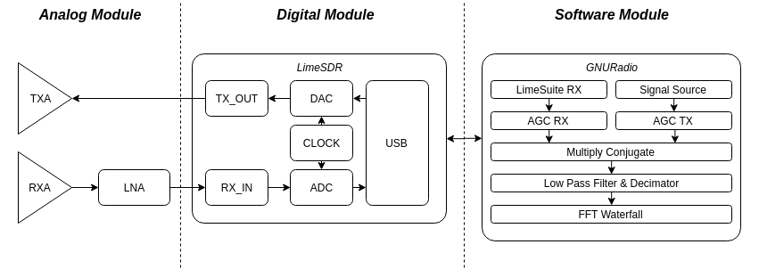
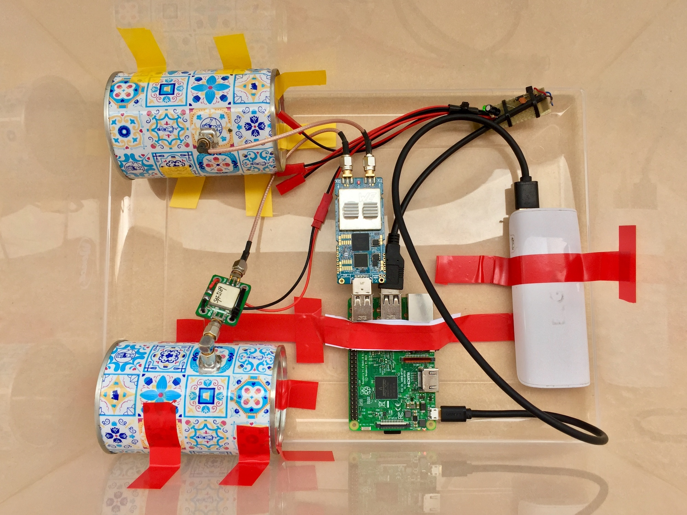
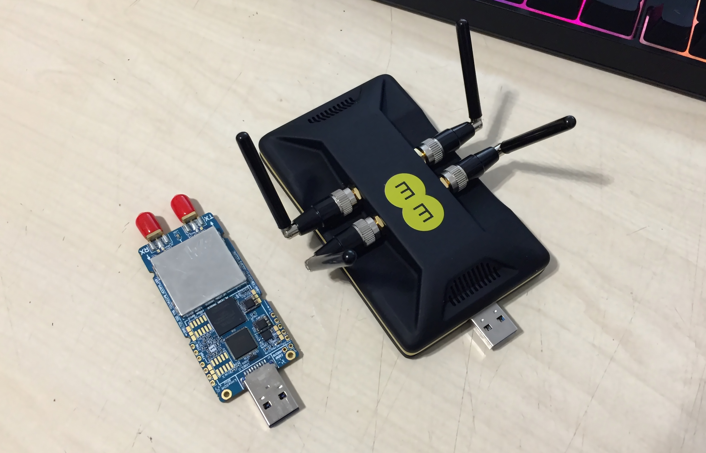
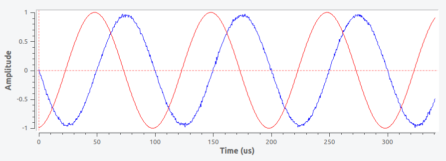
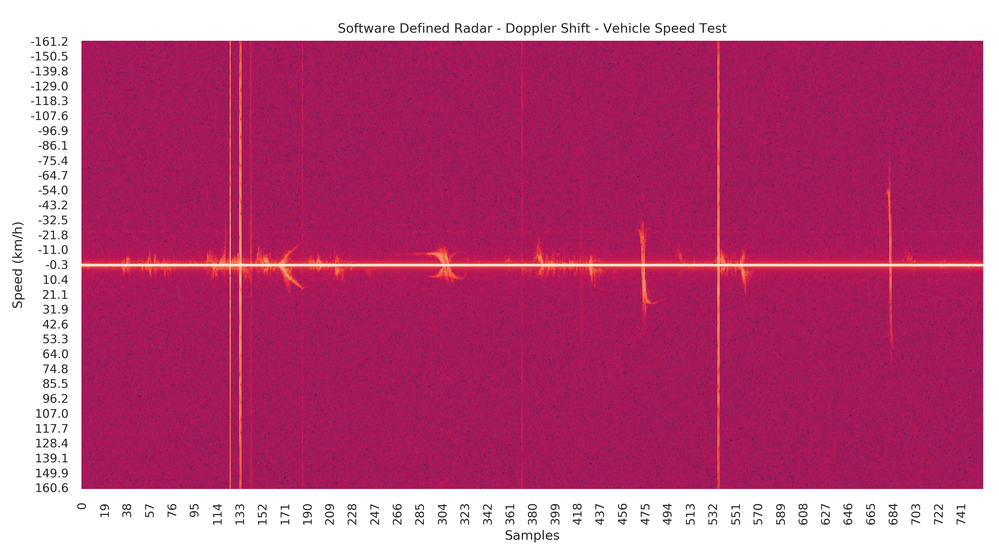

+++
title = "Software Defined Doppler Radar with LimeSDR Mini"
date = "2018-11-23"
author = "Luigi Cruz"
authorTwitter = "luigifcruz"
showFullContent = false
math = true
+++

In this blog post, I’ll talk about my experiments with Software Defined Radar. This concept implies that radar systems can be simplified by abstracting analog hardware in favor of software implementations performing Digital Signal Processing inside a processor module. This is useful for aerospace applications. It lowers the complexity of the radar system consequently reducing the maintenance, weight and the probability of something misbehave in-flight.

After reading about that, I wondered if it was possible to make something similar to reduce the number of expensive analog front-end parts needed for a radar system. This build was inspired by the [Coffee Can Radar](https://ocw.mit.edu/resources/res-ll-003-build-a-small-radar-system-capable-of-sensing-range-doppler-and-synthetic-aperture-radar-imaging-january-iap-2011/) designed by Gregory L. Charvat. This is an awesome radar that can do lots of fun tricks like FMCW and SAR Imagery. The only “problem” with them is the analog devices from Mini-Circuits required for the front-end. They are great pieces of engineering but are expensive and often hard to get, particularly from outside Europe or USA. Would be great if we could use Software Defined Radar approach to decrease the number of analog blocks needed therefore lowering the cost and simplifying assembly and testing. 

With that in mind, I started my experiments with a simplistic radar design and scaling things up as I become more confident. This blog post will talk about the simplest radar called Continuous Wave Radar and the next one will be about FMCW.

The diagram above shows how this device works. There are three main parts, the Analog Front-End, responsible to transmit, receive and amplify the signal; Digital Front-End, composed of a Software Defined Radio capable of Transmit and Receive at the same time at 2.4 GHz, here I used a LimeSDR Mini; Software Processing, where all computations are made, for this I’m using the Open-Source Software GNURadio Companion since it’s interactive and easy to use. Every computer should handle the sample rate required for this kind of radar.

The 2.4 GHz base frequency was kept because most of the SDRs can transmit and receive in this frequency without an up-converter. Furthermore, this frequency is inside the ISM Band meaning that the user doesn’t need to worry about interfering with other services. Disclaimer: Before transmitting any radiofrequency always check the local law. There are also downsides for using this frequency, for example, the interference with the 802.11 Wireless Routers and the bad propagation inside dense materials like walls. 

In the following sections, I will explain in detail each radar module and how it performed in the real world. The overall results were better than expected for such a simplistic radar. But first, let remember what Continuous Wave Doppler Radar really is… 

## Continuous Wave Doppler Radar 
Single Frequency Continuous Wave Radar is a very simplistic kind of radar. They are relatively inexpensive and easy to manufacture, in fact, they are used even in children toys and motion sensors. They are used to determine the speed of a moving target. This is possible because the radar will transmit a carrier wave at a fixed frequency towards a body in movement that will reflect some of the transmitted wave back to the radar. The received wave will have a phase shift compared to the original signal. The rate of change of this phase shift is known as Doppler Shift. This effect is measured in Hz and it’s proportional to the speed of the target. Intuitively, it won’t be able to measure the distance from stationary targets because there is no Doppler Shift.

The formula this project is using to measure the speed of a target can be derived from the Doppler Shift Effect equation stated below. There is no need to use Einstein's Theory of Special Relativity here because both targets are in the same frame of reference.

$$ f_r = f_t \left( \frac{c+v}{c-v} \right) $$

the frequency shift generated by the target ($f_d$) is thus:

$$ \Delta f_d = f_r-f_t = 2v \frac {f_t}{(c-v)} $$

Considering most realistic applications, the speed of a target won’t be any closer to the Speed of Light ($c$) hence the previous equation can be simplified by $c \approx (c-v)$. 

$$ \Delta f_d \approx 2v \frac {f_t}{(c)} $$

further simplifying by replacing velocity over frequency ($v/f_t$) by Wavelength ($\lambda$):

$$ \Delta f_d \approx \frac {2v}{\lambda} $$

Since the final goal is to obtain the speed of the target from the Frequency Shift the equation above can be rewritten as:

$$ V \approx \frac {f_d*\lambda}{2} $$

## Analog Front-End
This analog module is responsible for emitting and receiving two signals required by this radar. The first one is the Carrier Wave produced by the Digital Front-End radiated toward a target and a second is a scattered wave coming from a target containing a Doppler Shift. Due to the Software Defined Radar concept, this is the simplest and cheapest part of this build. Most components used here can be made by the user or bought from China.

The main part of this radar are these two “cantennas”. This is a directional antenna made with a tin-can that have a diameter and waveguide proportional to the wavelength of the radio wave it’s intended to receive or transmit. They are popular with the amateur community because they are easy to manufacture and have great performance. The length of the components for this 2.4 GHz cantenna can be found [here](https://www.changpuak.ch/electronics/cantenna.php). This simplistic front-end design lacks a power amplifier, therefore, the transmission power will be limited by the SDR employed in the next module, consequently limiting the maximum range.

For better results, a commercial directional antenna like horn or patch antennas can be used here. This will be useful for future projects since the manufacturer provides all technical information like radiation pattern and gain.

The second part of the analog front-end is the receiver’s low-noise amplifier. Here, I’m using a wideband SPF5189 that have a great performance with a low noise figure. They are extremely easy to get and are inexpensive. This is needed because the scattered signal coming from the target is quite faint, this amplifier will help to increase the SNR. This LNA is connected to the Receiving Antenna (RXA) with the Input (IN) port.

## Digital Front-End
This module is an essential part of this radar. It serves as a bridge between software and hardware. The scattered signal coming from the target is digitized to be later processed and the signal to be transmitted is generated. All signals are sent to and received from the computer software via a USB connection.

This is by far the most expensive module of this equipment. It will require a Software Defined Radio capable of Transmitting (TX) and Receiving (RX) at the same time, a feature known as full duplex. The cost of these radios can vary from hundreds to thousands of dollars. Here, I’m using the LimeSDR Mini ($159,00 USD at [CrowdSupply](https://www.crowdsupply.com/lime-micro/limesdr-mini)) which is excellent for this type of research.

The LimeSDR Mini device is the little brother of the LimeSDR USB with more or less half of the capacity. It provides full-duplex transmission and reception of signals up to 30.72 msps of bandwidth. It also delivers 12 bits of ADC resolution and a frequency range from 10 MHz to 3.5 GHz. Since this is a high-bandwidth radio, the host computer and the USB 3.0 chipset need to manage the huge amount of data for a smooth experience. A Linux based OS is also recommended. Fortunately, this project’s radar type uses only 4 msps of bandwidth, so every computer should maintain this data stream.

The connection between the Digital and Analog Front-End is pretty straightforward with the LimeSDR. The Transmitting Antenna (TXA) is connected straight into the TX port of the SDR and the Output (OUT) of the Low-Noise Amplifier is connected into the RX port as shown below.

## Software Processing
For simplicity and compatibility reasons this radar was implemented with the Open-Source Software GNU Radio Companion. It offers a great multi-OS platform for prototyping Digital Signal Processing workflows that are extremely easy to customize. This project’s GitHub [repository](https://github.com/luigifcruz/software-radar) has everything needed to get started with this radar. Other radars will be added as they are being developed.

For the near future, I’m planning to develop a custom open-source software made specifically for radar applications. This software will enable the development of more convoluted Software Defined Radar and greatly reduce the overhead of those calculations.

To reproduce the theory described in the second section of this article, the radar needs to transmit a carrier wave at 2.4 GHz. The generation of this wave is handled by the Signal Source Block. The parameters in the table below will generate a cosine wave at 1 kHz higher than the SDR’s transmission frequency ($f_t = f_0+1e3$) with a sampling rate of 2 msps. The next step is to transmit the generated carrier wave and receive the scattered signal using the SDR. This can be done with built-in gr-osmocom blocks that have support for almost all radios. If the project is using a LimeSDR, the gr-limesdr blocks are preferred since they are more stable and offers a broader range of settings. The Transmission Block is connected directly with the Signal Source Block and the output of the Reception Block is connected to an Automatic Gain Control Block to match the amplitude of the carrier wave.

If everything is working correctly, both transmitted (red) and received (blue) real signals should have the same frequency and amplitude with a phase difference between them as shown in the plot below. If the received signal is noisy or indistinguishable from a cosine wave, check if the LNA and antenna are working properly. Expect some occasional noise, since the frequency this radar uses is the same as WiFi routers and other ISM equipment.

Those two waves are then mixed together by the digital counterpart of an Analog Mixer, the Multiply Conjugate Block. As its name suggests, this block will multiply and conjugate both signals together generating a third signal that is equal to the component of multiple Doppler Shifts created by all objects moving inside the antenna radiation pattern. Some residual carrier wave should be also visible since the transmitted and received signals aren’t completely equal in amplitude and other imperfections.

Since the Doppler Shift of a 2.4 GHz signal is small for terrestrial speeds, the mixer output needs to be resampled to a lower sample rate. To archive that, the Multiply Conjugate Block is connected to the Low Pass Filter Block input. This block will decimate and filter the 2 msps by 2048 times resulting in a 2.441 ksps signal. As shown below, the generated FFT Plot have the transmitted carrier wave at the center and on both sides the Doppler Shift frequencies. This frequency domain visualization also permits the identification of all Doppler Shift components. This means that multiple targets can be identified at the same time.

## Testing
To validate that the radar was actually working, I made an indoor test with a fan in front of the antennas. Since the blades of the fan are angled, the circular movement generates a linear motion that the radar can detect. With an ideal sampling rate, this speed component would be like a sawtooth wave, but since they are rotating at a high speed, this radar doesn’t have the temporal resolution to measure them. This test produced a very clear line of the speed in the spectrogram. Beyond the speed, it was possible to see acceleration variations when a speed shift happened. This test can be seen in the video below. 



The next experiment was made measuring the speed of vehicles. In the first attempt, the radar was put on the side of the sidewalk and pointed to the cars in movement. The resulting complex stream from the Low Pass Filter Block was recorded on a disk. This data was later turned into the spectrogram below by a Python script. The Doppler Shift measured in Hz was converted to km/h using the last equation from Continuous Wave Doppler Radar. The speed of all twelve vehicles that passed that street can be seen in the spectrogram represented with S-shaped vertical lines. The speed is negative when the vehicle is coming towards the radar and negative when it is moving away. There are also smaller vertical lines attributed to pedestrians passing by.

Since everything worked as it should, the testing moved forward to something a little bit more challenging. This time, the radar was positioned 50 meters away from the highway angled at 45 degrees as shown in the image below. Some unplanned adverse conditions like high weeds in front of the radar and the extreme heat that made the Raspberry Pi automatically shut down multiple times, might have affected the result for worse. The data handling happened just like the previous test.

The generated spectrogram shows a similar result from the last test. The vehicles passing by the roadway caused the Doppler Shift that can be seen as the S-shaped vertical lines close to the center. The longest distance from the roadside contributed to the generation of a sharper S curve since the radar had more time to sample each vehicle. The top speed recorded by the radar was about 78 km/h which is lower than the speed limit of 80 km/h at that location.

This last experiment was made to make sure the radar was measuring the correct speed. This time a car will pass in front of the radar at a fixed speed. If the speed of the car’s speedometer matches the speed measured by the radar, the results can be validated. The car made three passes with incremental speeds of 10 km/h, 30 km/h and 60 km/h. This test can be seen in the video below. Note that the FFT view shows the amplitude of the signal in respect to the frequency shift. To simplify the analysis process, the spectrogram was generated with the automatic conversion from frequency to speed. The result has shown that the car was indeed at the right speed at each pass, respectively 9.3 km/h, 28.8 km/h and 56.0 km/h.



Quick Note: I didn't have much time to make more experiments with this radar. But in the next blog article, I will explore more applications of this type of radar.

## Conclusion 
As we can see in the tests above, this project had pretty good results for such a minimalistic approach. We saw that the Software Defined Radar concept can be built at an affordable price at an amateur level without expensive radios and convoluted analog gear. Of course, this isn’t ready for any serious purpose but it can be an excellent starting point for people interested to learn how radar systems operate.

It was fun to develop and see how the theory works in practice. It also inspired me to build another type of more advanced radar based on software processing. Follow me on Twitter to get the latest updates about my projects. This blog also has an RSS Feed available for your preferred RSS app.

_Thanks for reading!_
